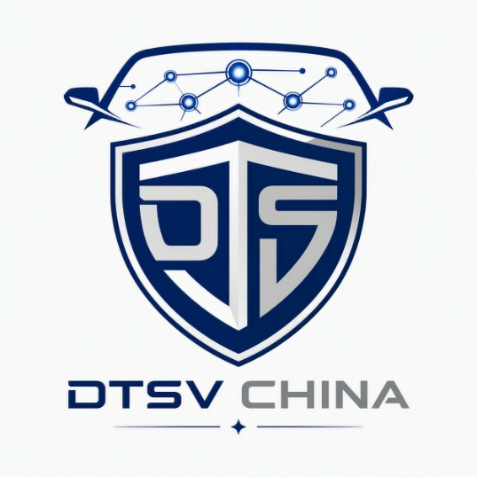

<p align="center">
  <a href="#">
    
  </a>
  <h1 align="center">OpenTPM</h1>
  <p align="center">AI-Powered Test Process Management & Defect Analysis Platform</p>
</p>

---

## Overview

**OpenTPM** is an AI-driven test process management platform built on top of [LibreChat](https://github.com/danny-avila/LibreChat). It integrates large language model capabilities with automotive testing workflows — enabling intelligent defect analysis, test case generation, and quality insights through natural language interaction.

## Key Features

### Defect Intelligence
- Conversational defect querying and analysis
- Automated defect-to-test-case mapping
- Severity classification and trend analysis
- Natural language reporting for quality metrics

### Test Case Management
- AI-assisted test case generation from defect descriptions
- Batch test case creation with pattern recognition
- Test coverage gap identification
- Traceability between requirements, defects, and test cases

### AI Agent & MCP Integration
- Custom MCP (Model Context Protocol) servers for domain-specific tools
- Agent-based workflows for complex analysis tasks
- Multi-model orchestration for different analysis stages
- Extensible plugin architecture for new testing tools

### Enterprise-Ready
- SSO authentication integration
- Multi-tenant deployment support
- Private/on-premise deployment with Docker
- Configurable model endpoints (local LLM, cloud API, or hybrid)

## Getting Started

### Prerequisites

- Node.js v24+
- MongoDB 7.0+
- npm (comes with Node.js)

### Installation

```bash
# Clone the repository
git clone https://github.com/tonyoorz/OpenTPM.git
cd OpenTPM

# Install dependencies
npm run smart-reinstall

# Copy and configure environment
cp .env.example .env
# Edit .env with your configuration

# Start the backend (port 3080)
npm run backend:dev

# In another terminal, start the frontend (port 3090)
npm run frontend:dev
```

### Docker Deployment

```bash
cp .env.example .env
# Edit .env with your configuration

docker compose up -d
```

## Tech Stack

| Layer | Technology |
|---|---|
| Backend | Node.js, Express |
| Frontend | React, TypeScript, Tailwind CSS |
| Database | MongoDB |
| AI | Multi-model support (OpenAI-compatible APIs, local LLMs) |
| Tooling | Model Context Protocol (MCP) servers |

## Acknowledgements

This project is built on [LibreChat](https://github.com/danny-avila/LibreChat) by Danny Avila. We gratefully acknowledge the upstream project and its community.

## License

This project inherits the MIT License from the upstream LibreChat project. See [LICENSE](LICENSE) for details.

## Links

- **GitHub**: [github.com/tonyoorz/OpenTPM](https://github.com/tonyoorz/OpenTPM)
- **Upstream**: [github.com/danny-avila/LibreChat](https://github.com/danny-avila/LibreChat)
