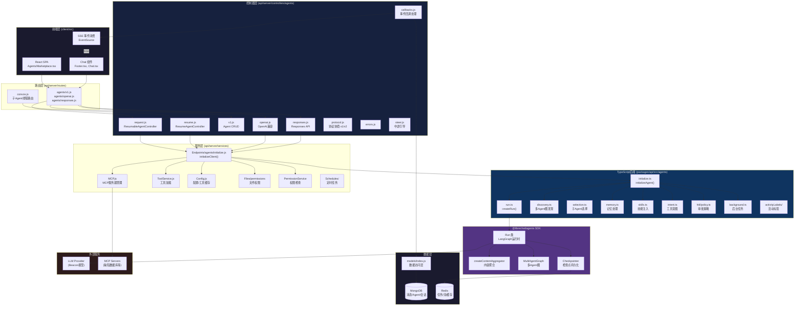
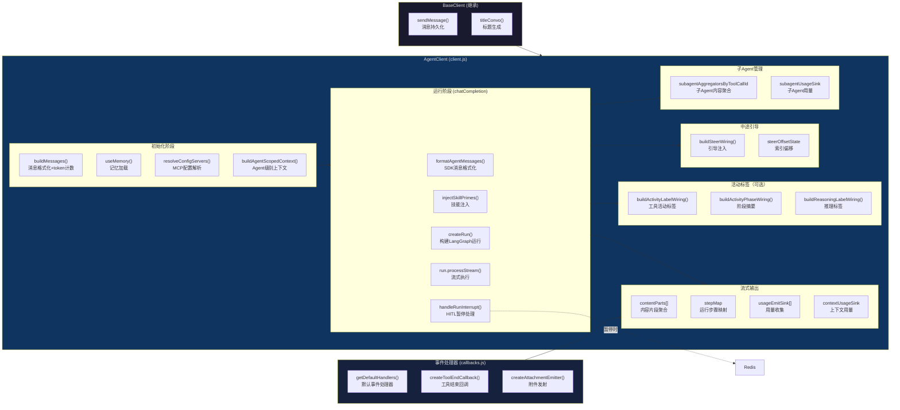
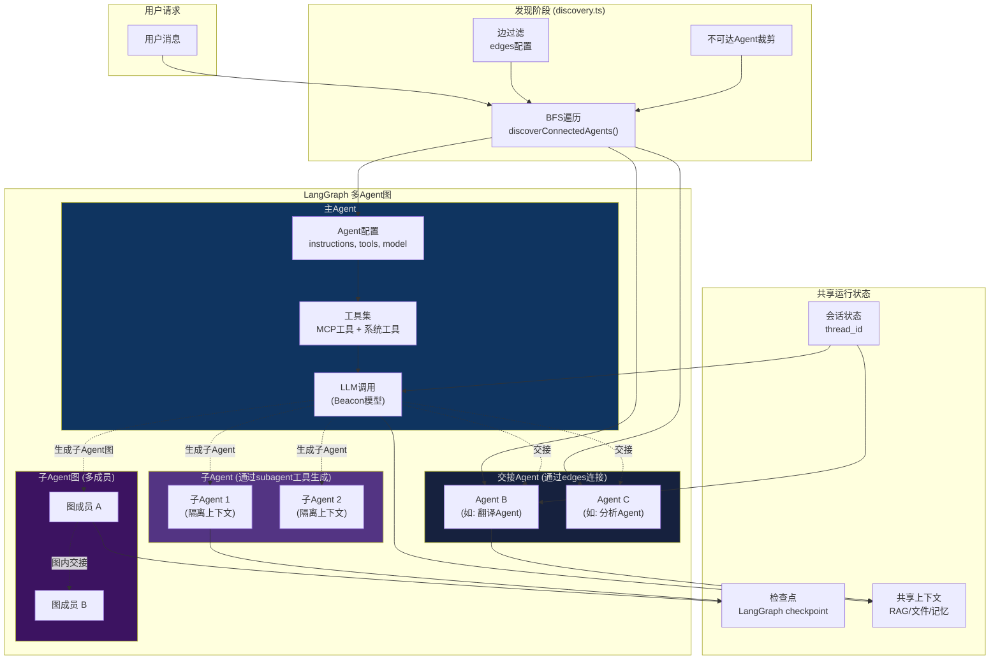
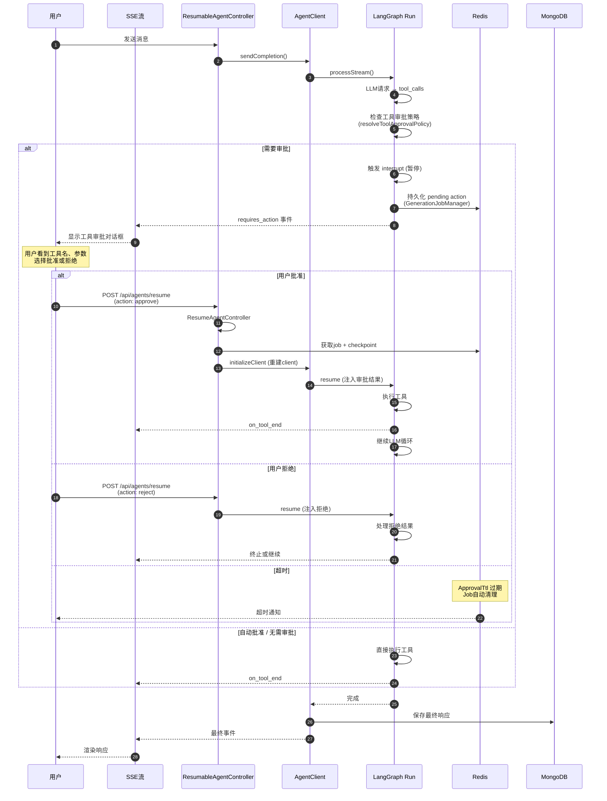
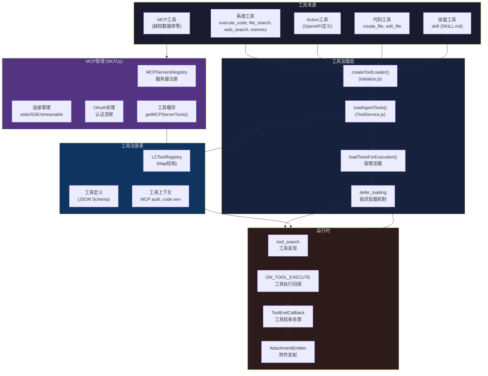
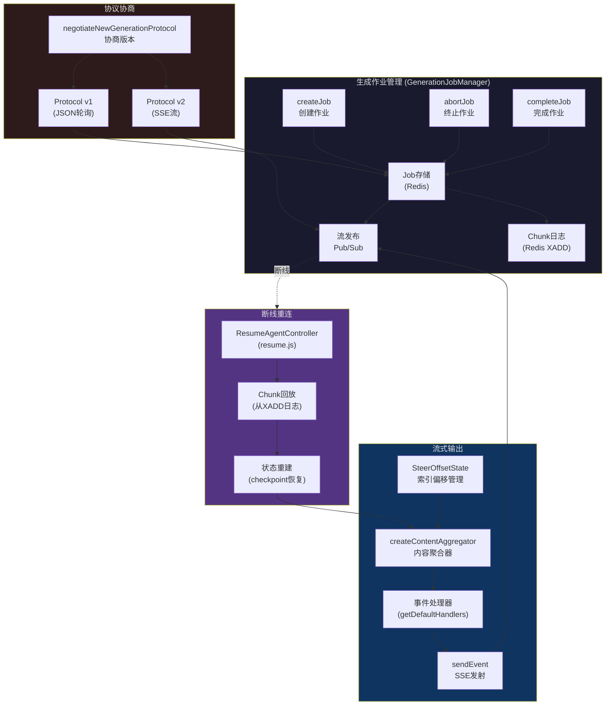
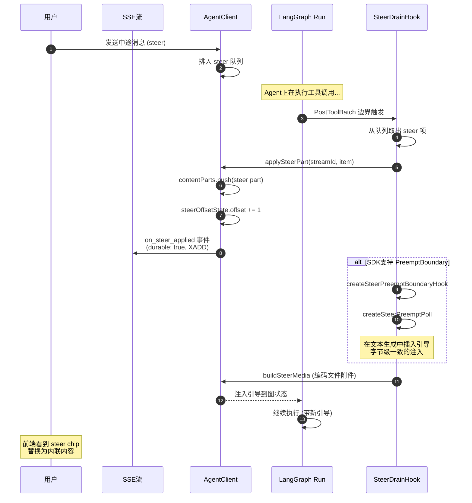
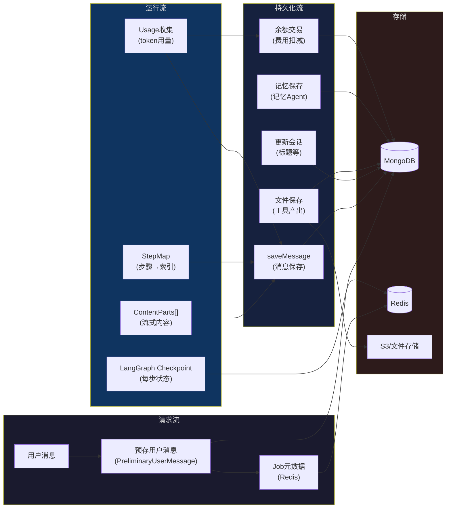
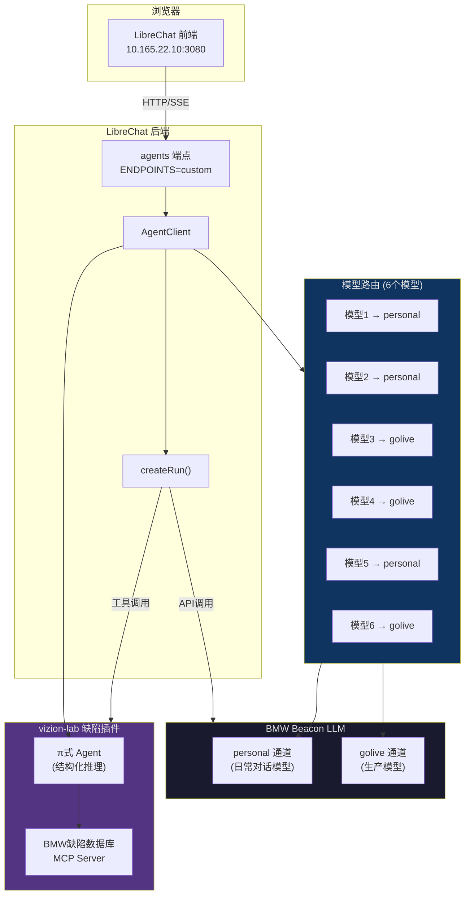

# LibreChat Agent 架构图

> 基于代码库实际代码分析生成。涵盖架构总览、核心组件、请求时序、多 Agent 协作、HITL 审批流程等。

---

## 1. 总体架构图（分层视图）

---

## 2. 核心组件关系图（AgentClient 内部结构）

---

## 3. 完整请求时序图（从用户消息到响应完成）

```mermaid
sequenceDiagram
    autonumber
    participant U as 用户/前端
    participant R as Express路由
    participant RC as ResumableAgentController<br/>(request.js)
    participant IC as initializeClient<br/>(initialize.js)
    participant IA as initializeAgent<br/>(packages/api TS)
    participant AC as AgentClient<br/>(client.js)
    participant SDK as createRun + Run<br/>(@librechat/agents)
    participant LLM as LLM Provider
    participant MCP as MCP Servers
    participant DB as MongoDB
    participant RD as Redis
    participant SSE as SSE流

    U->>R: POST /api/agents/chat (消息+conversationId)
    R->>RC: ResumableAgentController(req, res, next, initializeClient, addTitle)

    rect rgb(20, 30, 50)
        Note over RC: 阶段1: 请求预处理
        RC->>RC: negotiateNewGenerationProtocol(req)
        RC->>RC: 验证 clientRequestId, overrideId 等
        RC->>RC: resolveConversationAnchor (获取会话时间戳)
        RC->>RC: getPreliminaryUserMessage (预存用户消息)
        RC->>RD: GenerationJobManager.createJob(streamId)
        RC->>RC: checkAndIncrementPendingRequest (并发控制)
    end

    rect rgb(30, 50, 30)
        Note over RC,IC: 阶段2: 客户端初始化
        RC->>IC: initializeClient({req, res, signal, endpointOption, jobCreatedAt})
        IC->>IC: Promise.all([memoryAvailable, accessibleSkillIds,<br/>skillStates, validatedPrimaryAgent, requestConversation])

        IC->>IA: initializeAgent({req, agent, loadTools, ...})
        IA->>IA: getProviderConfig (解析Provider配置)
        IA->>IA: resolveToolApprovalPolicy (HITL策略)
        IA->>IA: registerCodeExecutionTools (代码执行工具)
        IA->>IA: registerMemoryTools (记忆工具)
        IA->>IA: injectSkillCatalog (技能目录)
        IA->>IA: buildHITLRunWiring (HITL接线)
        IA-->>IC: primaryConfig (已初始化的Agent配置)

        IC->>IC: discoverConnectedAgents (BFS发现多Agent图)
        IC->>IC: processAddedConvo (多会话Agent)
        IC->>IC: buildSubagentThreadTaskConfig (子Agent任务)

        IC->>AC: new AgentClient({req, res, agent, contentParts,<br/>eventHandlers, agentConfigs, ...})
        IC-->>RC: {client, userMCPAuthMap}
    end

    rect rgb(50, 30, 20)
        Note over RC,AC: 阶段3: 消息构建
        RC->>AC: client.sendCompletion(payload, {onProgress, abortController})
        AC->>AC: buildMessages(messages, parentMessageId)
        AC->>AC: formatMessage (每条消息格式化)
        AC->>AC: countTokens (token计数)
        AC->>AC: useMemory() (加载记忆)
        AC->>AC: resolveConfigServers (MCP配置)
        AC->>AC: buildAgentScopedContext (Agent级上下文)
        AC->>AC: applyContextToAgent (应用到所有Agent)
        AC-->>AC: {prompt, promptTokens, messages}
    end

    rect rgb(40, 20, 50)
        Note over AC,SDK: 阶段4: 运行创建与执行
        AC->>AC: chatCompletion({payload, abortController})
        AC->>AC: formatAgentMessages (SDK格式化)
        AC->>AC: injectSkillPrimes (技能注入)
        AC->>AC: buildSteerWiring (引导接线)
        AC->>AC: buildActivityLabelWiring (活动标签接线)

        AC->>SDK: createRun({agents, messages, customHandlers,<br/>steering, hitlCapable, signal, ...})
        SDK->>SDK: MultiAgentGraph 构建
        SDK->>SDK: Checkpointer 挂载
        SDK-->>AC: Run 实例

        AC->>SDK: run.processStream({messages}, config)
        SDK-->>SSE: 流式事件 (on_run_step, on_message,<br/>on_tool_call, on_tool_end, ...)

        loop 工具调用循环
            SDK->>LLM: 请求LLM生成
            LLM-->>SDK: 响应 (可能含tool_calls)

            alt 有工具调用
                SDK->>MCP: 执行MCP工具
                MCP-->>SDK: 工具结果
                SDK-->>SSE: on_tool_end 事件

                alt HITL审批触发
                    SDK->>SDK: 暂停运行 (interrupt)
                    SDK->>RD: 持久化pending action
                    SDK-->>SSE: requires_action 事件
                    SSE-->>U: 显示审批请求
                    Note over U: 等待用户审批...
                end
            end

            SDK->>DB: (异步)保存消息
            SDK-->>SSE: on_token_usage 事件
        end

        SDK-->>AC: 运行完成
        AC->>AC: handleRunInterrupt (检查HITL暂停)
        AC->>AC: settleActivityLabels (结算标签)
        AC->>AC: finalizeSubagentContent (子Agent内容)
        AC->>AC: buildResponseMetadata (构建元数据)
    end

    rect rgb(20, 40, 40)
        Note over RC,U: 阶段5: 响应完成
        AC-->>RC: {completion, metadata}
        RC->>DB: saveMessage (保存响应消息)
        RC->>RD: GenerationJobManager.completeJob
        RC->>RC: finishResumableRequest (清理)
        RC->>RC: decrementPendingRequest
        RC-->>SSE: 最终事件
        SSE-->>U: 渲染完整响应

        par 异步任务
            RC->>AC: addTitle (标题生成)
            AC->>LLM: 生成会话标题
            AC->>DB: 更新会话标题
        and 记忆处理
            AC->>AC: runMemory (记忆提取)
            AC->>DB: 保存记忆
        end
    end
```

---

## 4. 多 Agent 协作架构图

---

## 5. HITL（Human-in-the-Loop）审批时序图

---

## 6. 工具系统架构图

---

## 7. 流式输出与可恢复机制图

---

## 8. 中途引导（Steering）机制图

---

## 9. 数据流与持久化架构图

---

## 10. 关键文件索引

| 层级 | 文件 | 核心职责 |
|---|---|---|
| **路由** | `api/server/routes/agents/v1.js` | Agent CRUD + 分类 |
| **路由** | `api/server/routes/agents/openai.js` | OpenAI 兼容聊天端点 |
| **路由** | `api/server/routes/agents/responses.js` | Responses API 端点 |
| **控制器** | `api/server/controllers/agents/request.js` | `ResumableAgentController` — 主请求入口 |
| **控制器** | `api/server/controllers/agents/resume.js` | `ResumeAgentController` — 恢复/HITL |
| **控制器** | `api/server/controllers/agents/client.js` | `AgentClient` — 核心 Agent 客户端 (4611行) |
| **控制器** | `api/server/controllers/agents/v1.js` | Agent CRUD 逻辑 (创建/更新/删除) |
| **控制器** | `api/server/controllers/agents/callbacks.js` | 事件回调 (工具结束、附件、进度) |
| **控制器** | `api/server/controllers/agents/protocol.js` | v1/v2 协议协商 |
| **控制器** | `api/server/controllers/agents/steer.js` | 中途引导 |
| **控制器** | `api/server/controllers/agents/errors.js` | 错误处理 |
| **服务** | `api/server/services/Endpoints/agents/initialize.js` | `initializeClient()` — 客户端工厂 |
| **服务** | `api/server/services/MCP.js` | MCP 服务器连接、OAuth、工具 |
| **服务** | `api/server/services/Config.js` | 配置缓存、工具缓存 |
| **服务** | `api/server/services/ToolService.js` | `loadAgentTools`, `loadToolsForExecution` |
| **TS后端** | `packages/api/src/agents/initialize.ts` | `initializeAgent()` — Agent初始化核心 |
| **TS后端** | `packages/api/src/agents/run.ts` | `createRun()` — LangGraph运行构建 |
| **TS后端** | `packages/api/src/agents/discovery.ts` | 多Agent图发现 (BFS) |
| **TS后端** | `packages/api/src/agents/memory.ts` | 记忆工具注册 |
| **TS后端** | `packages/api/src/agents/skills.ts` | 技能注入、priming |
| **TS后端** | `packages/api/src/agents/hitl/policy.ts` | 工具审批策略 |
| **TS后端** | `packages/api/src/agents/background.ts` | 后台任务工具 |
| **SDK** | `@librechat/agents` (外部仓库) | Run, MultiAgentGraph, Checkpointer |
| **前端** | `client/src/components/Agents/Marketplace.tsx` | Agent 市场 UI |
| **前端** | `client/src/components/Chat/Footer.tsx` | 聊天输入 + 工具栏 |

---

## 11. BMW Beacon 环境下的特定架构

---

## 总结

LibreChat 的 Agent 架构是一个高度模块化的多Agent系统，核心设计要点：

1. **分层清晰**: 前端 → 路由 → 控制器 → 服务 → TS包 → SDK → 外部服务
2. **TypeScript迁移**: 新代码在 `packages/api` (TS)，旧代码在 `api/` (JS)，渐进迁移
3. **多Agent图**: 通过 BFS 发现连接的 Agent，支持交接(handoff)和子Agent(spawn)
4. **可恢复流式**: 基于 Redis 的 GenerationJobManager，支持断线重连和 HITL 恢复
5. **工具系统**: MCP + 系统工具 + Actions + 代码工具 + 技能，支持延迟加载
6. **中途引导**: 用户可在Agent执行中途注入新指令，通过索引偏移保证一致性
7. **HITL审批**: 工具执行可暂停等待用户审批，基于 LangGraph checkpoint
8. **用量追踪**: 精确的token计费、子Agent用量聚合、活动标签成本归集
